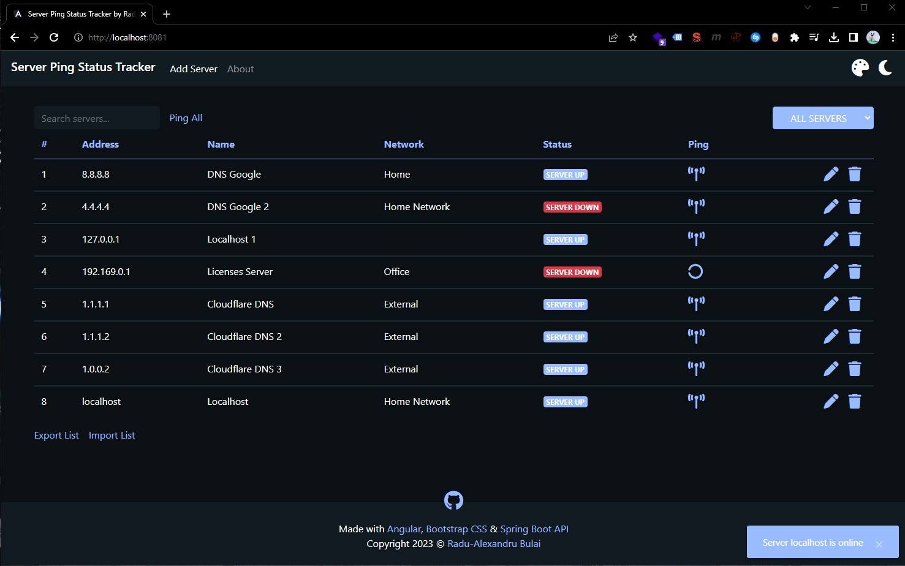
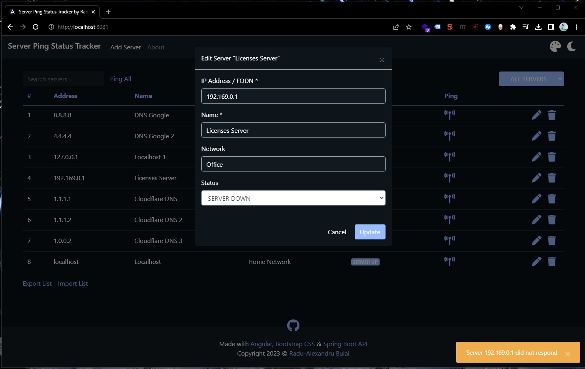
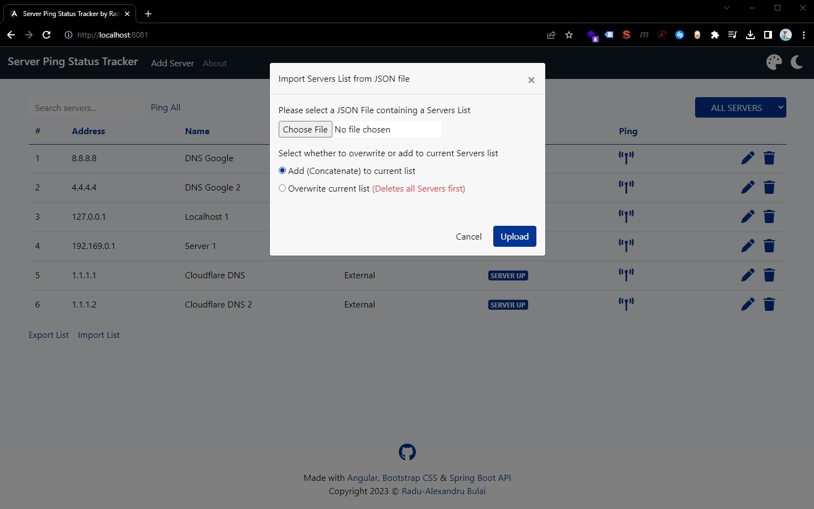
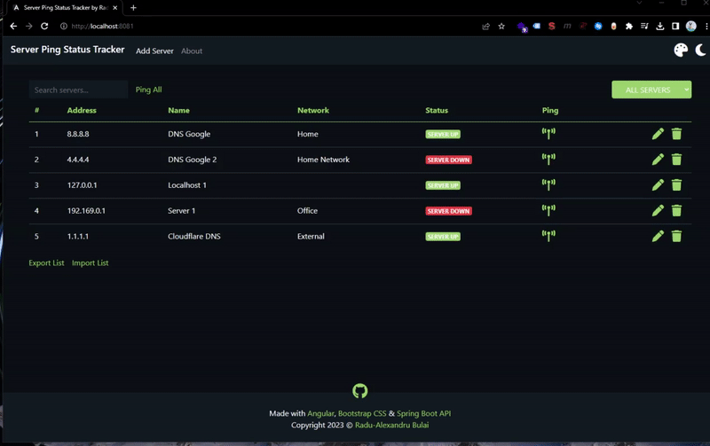

# Server Ping Status Tracker App with Angular and Spring Boot REST API

Server Ping Status Tracker is a web-based application built with Angular and Spring Boot REST API (connected to a MySQL database) that allows users to monitor servers availability in a local network by performing ping tests and displaying their online/offline status.

This project is adapted and feature-enhanced from [Full Stack Spring Boot RESTful API with MySQL and Angular - 4 Hour Youtube Playlist - getarrays.io | Roland Toussaint "Junior"](https://www.youtube.com/playlist?list=PLopcHtZ0hJF0OIOr88qHuJ3-UKRuCUrKf) tutorial. The complete personal documentation for this project can be found here: [Spring Boot with Angular App: Server Ping Status Tracker - Notes by Radu-Alexandru B](https://github.com/radualexandrub/Study/blob/master/SpringBoot/SpringBootAngularPingStatusApp.md).

Initial commit - Thursday, July 06, 2023

Contents:

- [Server Ping Status Tracker App with Angular and Spring Boot REST API](#server-ping-status-tracker-app-with-angular-and-spring-boot-rest-api)
  - [Screenshots](#screenshots)
  - [App Features](#app-features)
  - [Spring Boot REST API URLs - Endpoints](#spring-boot-rest-api-urls---endpoints)
  - [Running locally with Docker 🚀](#running-locally-with-docker-)
    - [Docker resources and issues](#docker-resources-and-issues)
  - [Installing dependencies and running locally](#installing-dependencies-and-running-locally)
    - [Clone this repository](#clone-this-repository)
    - [Configure MySQL](#configure-mysql)
    - [Install and Configure Java and Maven](#install-and-configure-java-and-maven)
    - [Install Node.js, npm and Angular](#install-nodejs-npm-and-angular)
    - [Running the app locally](#running-the-app-locally)
  - [License](#license)

<br/>

## Screenshots








:
<br/>

## App Features

- **Track Server Status:** Monitor the status of multiple servers in your network.
- **Ping Servers:** Initiate manual pings to update server statuses. Or, ping all servers in the list.
- **Add Servers:** Easily add servers to the list (saved in MySQL database).
- **Edit Server Details:** Modify server information like IP address, name, and network.
- **Search and Filter Servers:** Search servers by IP/name/network or filter servers by status (all, up, down) to focus on specific groups.
- **Dark mode and Custom Color Accent:** Personalize the app's UI using your favorite theme and colors (preferences are stored in local storage)!
- **JSON Export/Import Support:** Export all existing servers to a JSON file. Add multiple servers at once from JSON to existing servers in MySQL DB.
- **Angular Reactive Approach:** Utilizes Angular's reactive features for efficient state management.
- **Docker Support:** Easily deploy with Docker for containerization.

<br/>

## Spring Boot REST API URLs - Endpoints

Base URL: http://localhost:8080/api

Endpoints for `Servers` SQL Table

- GET http://localhost:8080/api/servers/ - Gets a list of all servers

```json
// Response Body Example
{
  "timeStamp": "2023-08-28T21:10:19.4835367",
  "statusCode": 200,
  "status": "OK",
  "message": "Servers retrieved",
  "data": {
    "servers": [
      {
        "id": 309,
        "ipAddress": "8.8.8.8",
        "name": "DNS Google",
        "network": "External",
        "status": "SERVER_UP"
      },
      {
        "id": 310,
        "ipAddress": "192.169.0.1",
        "name": "Server 1",
        "network": "Office",
        "status": "SERVER_UP"
      }
    ]
  }
}
```

- GET http://localhost:8080/api/servers/{{id}} - Gets server by id (saved in app's MySQL database)

```json
// Response Body Example for GET http://localhost:8080/api/servers/318
{
  "timeStamp": "2023-08-28T21:08:42.4467434",
  "statusCode": 200,
  "status": "OK",
  "message": "Server retrieved",
  "data": {
    "server": {
      "id": 318,
      "ipAddress": "1.1.1.1",
      "name": "Cloudflare DNS",
      "network": "External",
      "status": "SERVER_UP"
    }
  }
}
```

- GET http://localhost:8080/api/servers/ping - Pings all servers then gets the server with their updated statuses

- GET http://localhost:8080/api/servers/ping/{{ipAddress}} - Pings and retrieves server by ipAddress with updated status from app's database

```json
// Response Body Example for GET http://localhost:8080/api/servers/ping/8.8.8.8
{
  "timeStamp": "2023-08-28T21:26:27.7341757",
  "statusCode": 200,
  "status": "OK",
  "message": "Ping success",
  "data": {
    "server": {
      "id": 309,
      "ipAddress": "8.8.8.8",
      "name": "DNS Google",
      "network": "External",
      "status": "SERVER_UP"
    }
  }
}
```

- GET http://localhost:8080/api/servers/{{id}}/ping - Pings and retrieves server by id with updated status from app's database

- POST http://localhost:8080/api/servers/ - Creates a new server in database (id is automatically assigned)

```json
// Request Payload Example
{
  "ipAddress": "127.0.0.4",
  "name": "Home Server 4",
  "network": "Home Network",
  "status": "SERVER_DOWN"
}

// Response Body Example
{
  "timeStamp": "2023-08-28T21:28:47.6976221",
  "statusCode": 201,
  "status": "CREATED",
  "message": "Server created",
  "data": {
    "server": {
      "id": 319,
      "ipAddress": "127.0.0.4",
      "name": "Home Server 4",
      "network": "Home Network",
      "status": "SERVER_DOWN"
    }
  }
}
```

- POST http://localhost:8080/api/servers/save-all - Creates a list of new servers in database (ids from request payload are automatically deleted are automatically re-assigned)

```json
// Request Payload Example
[
  {
    "id": 194,
    "ipAddress": "1.1.1.2",
    "name": "Broken Cloudflare DNS",
    "network": "External",
    "status": "SERVER_DOWN"
  },
  {
    "id": null,
    "ipAddress": "1.0.0.2",
    "name": "Cloudflare DNS 2",
    "network": "External",
    "status": "SERVER_DOWN"
  }
]

// Response Body Example
{
    "timeStamp": "2023-08-28T21:32:50.977626",
    "statusCode": 201,
    "status": "CREATED",
    "message": "2 Servers created",
    "data": {
        "servers": [
            {
                "id": 320,
                "ipAddress": "1.1.1.2",
                "name": "Broken Cloudflare DNS",
                "network": "External",
                "status": "SERVER_DOWN"
            },
            {
                "id": 321,
                "ipAddress": "1.0.0.2",
                "name": "Cloudflare DNS 2",
                "network": "External",
                "status": "SERVER_DOWN"
            }
        ]
    }
}
```

- PUT http://localhost:8080/api/servers/ - Updates an existing server in database

```json
// Request Payload Example
{
  "id": "320",
  "ipAddress": "1.1.1.2",
  "name": "Working Cloudflare DNS 3",
  "network": "External",
  "status": "SERVER_UP"
}

// Response Body Example
{
    "timeStamp": "2023-08-28T21:36:13.4726756",
    "statusCode": 200,
    "status": "OK",
    "message": "Server updated",
    "data": {
        "server": {
            "id": 320,
            "ipAddress": "1.1.1.2",
            "name": "Working Cloudflare DNS 3",
            "network": "External",
            "status": "SERVER_UP"
        }
    }
}
```

- DELETE http://localhost:8080/api/servers/{{id}} - Deletes an existing server by id in database

```json
// Response Body Example for DELETE http://localhost:8080/api/servers/317
{
  "timeStamp": "2023-08-28T22:01:57.8004035",
  "statusCode": 200,
  "status": "OK",
  "message": "Server deleted",
  "data": {
    "deleted": true
  }
}
```

<br/>

Other endpoints:

- GET http://localhost:8080/api/ping/{{ipAddress}} - Pings a server by IP Address that does not exist in app's database

```json
// Response Body Example for GET http://localhost:8080/api/ping/127.0.0.2
{
  "timeStamp": "2023-08-28T21:06:06.8116655",
  "statusCode": 200,
  "status": "OK",
  "message": "Ping success",
  "data": {
    "server": {
      "id": null,
      "ipAddress": "127.0.0.2",
      "name": null,
      "network": null,
      "status": "SERVER_UP"
    }
  }
}
```

<br/>

## Running locally with Docker 🚀

Note: The containers will run this App for a Production environment:

- Front-End (configured in `Angular.Dockerfile`) will run the static build with Nginx
- Back-End (configured in `Spring.Dockerfile`) will run the application's built package
- MySQL8 (configured in `docker-compose.yml`)

Steps:

- Install [Docker Desktop](https://www.docker.com/products/docker-desktop/)

- Clone this repo

```bash
git clone https://github.com/radualexandrub/SpringBoot-Angular-Server-Ping-Status-Tracker serverpingstatustracker
cd serverpingstatustracker
```

- Build (and run as containers) the MySQL8 database, front-end and back-end images via `docker-compose.yml` file with [`docker compose up`](https://docs.docker.com/engine/reference/commandline/compose_up/) command

```bash
docker compose up

# or -d to supress logs (Detached mode: Run containers in the background)
docker compose up -d
```

- Open the front-end app (on http://localhost:8081/) and the back-end Spring API (on http://localhost:8080/)

- Play with the app (you can follow the app's logs with [`docker-compose logs -f`](https://docs.docker.com/engine/reference/commandline/compose_logs/))

- Stop all Docker containers

```bash
docker-compose down

# or use -v to also remove the volumes used for MySQL, also remove other remaining containers
docker-compose down -v --remove-orphans
```

- [Show](https://docs.docker.com/engine/reference/commandline/ps/) and [Remove built Docker images](https://docs.docker.com/engine/reference/commandline/image_prune/)

```bash
# Show all containers (default shows just running)
docker ps -a

# View images and their IDs
docker images -a

# Remove images by their IDs
docker rmi <angular_appImageID>
docker rmi <spring_appImageID>
docker rmi <mysql_db_ImageID>

# Or remove all images (including images from other apps!)
docker image prune -a
```

- Show Docker disk usage

```bash
docker system df
```

- (Optional) [Remove all Docker data](https://docs.docker.com/engine/reference/commandline/system_prune/) (including Images, Containers, Local Volumes and **Build Cache**)

```bash
docker system prune
```

<br/>

### Docker resources and issues

👉 **Docker resources I used:**

- [Learn Docker in 7 Easy Steps - Beginner's Tutorial by Fireship.io - Study Notes by Radu Alexandru B](https://github.com/radualexandrub/Study/blob/master/Docker/FireshipDockerBeginnerTutorial11m.md)
- [Docker Compose: Spring Boot and MySQL example - from BezKoder.com](https://www.bezkoder.com/docker-compose-spring-boot-mysql/)
- [**How to Dockerize Angular with NGINX and Spring Boot with MySQL using Docker Compose** - from javachinna.com](https://www.javachinna.com/angular-nginx-spring-boot-mysql-docker-compose/)

👉 **Issues encountered when running Docker containers:**

- [Dockerfile after build container doesn’t work ”Could not find or load main class”](https://forums.docker.com/t/dockerfile-after-build-container-doesnt-work-could-not-find-or-load-main-class/121348) - solved by adding whole path to `main()` java function (eg. `com.radubulai.serverpingstatustracker.ServepingstatustrackerApplication`)
- [Unable to open JDBC Connection for DDL execution](https://stackoverflow.com/questions/54211638/unable-to-open-jdbc-connection-for-ddl-execution)
- [Communications link failure , Spring Boot + MySql +Docker + Hibernate](https://stackoverflow.com/questions/58880998/communications-link-failure-spring-boot-mysql-docker-hibernate)
- [Could not create connection to database server via Docker](https://stackoverflow.com/questions/63667449/could-not-create-connection-to-database-server-via-docker) - got the Idea of delaying/waiting for MySQL8 container to fully be operational before Spring tries to connect to the database
- [Spring Boot + docker-compose + MySQL: Connection refused](https://stackoverflow.com/questions/54145220/spring-boot-docker-compose-mysql-connection-refused) - adding `healthcheck` to MySQL Image in `docker-compose.yml`
- [Docker Compose wait for container X before starting Y](https://stackoverflow.com/questions/31746182/docker-compose-wait-for-container-x-before-starting-y/41854997#41854997)
- [Connection Java - MySQL : Public Key Retrieval is not allowed](https://stackoverflow.com/questions/50379839/connection-java-mysql-public-key-retrieval-is-not-allowed) - adding client option to mysql-connector `allowPublicKeyRetrieval=true` to allow the client to automatically request the public key from the server => `jdbc:mysql://mysql-db:3306/pingstatustracker?autoReconnect=true&useSSL=false&allowPublicKeyRetrieval=true`

👉 **CORS related issues while running Docker containers and using the app:**

- [API Net 6 :: CORS issues when running inside Docker container](https://forums.docker.com/t/api-net-6-cors-issues-when-running-inside-docker-container/130446)
- ['Access-Control-Allow-Origin' with spring boot](https://stackoverflow.com/questions/46065156/access-control-allow-origin-with-spring-boot)
- Added `'Access-Control-Allow-Origin' '*'` in header in Angular App that is running on Nginx

```php
server {
  listen 80;
  location / {
    add_header 'Access-Control-Allow-Origin' '*';
    add_header 'Access-Control-Allow-Methods' 'GET, POST, OPTIONS, PUT, DELETE';
    add_header 'Access-Control-Allow-Headers' 'X-Requested-With,Accept,Content-Type, Origin';
    root /usr/share/nginx/html;
    index index.html index.htm;
    try_files $uri $uri/ /index.html =404;
  }
}
```

👉 **Issues encountered when running `docker compose up` on Debian (Linux):**

- Download and install Docker Desktop `.deb` package (that contains `docker compose`) for Debian from [here](https://docs.docker.com/desktop/install/ubuntu/) or RPM package for Fedora from [here](https://docs.docker.com/desktop/install/fedora/)
- [mvnw: Permission denied](https://github.com/pascalgrimaud/generator-jhipster-docker/issues/29) - fixed by making `mvnw` file executable - run `chmod +x mvnw` within the root project path
- [Error starting userland proxy: listen tcp4 0.0.0.0:3306: bind: address already in use](https://stackoverflow.com/questions/37896369/error-starting-userland-proxy-listen-tcp-0-0-0-03306-bind-address-already-in) - fixed by running `sudo netstat -nlpt | grep 3306` (installed by `sudo apt instal net-tools`) which finds MySQL running on port 3306 -> stop local MySQL from running with `sudo systemctl stop mysql.service`

👉 **Issues encountered when running `docker compose build` on a Windows machine:**

```
=> ERROR [serverpingstatustracker_spring-api build 6/9] RUN ./mvnw dependency:go-offline -B 0.3s
------
> [serverpingstatustracker_spring-api build 6/9] RUN ./mvnw dependency:go-offline -B:
#26 0.237 /bin/sh: 1: ./mvnw: not found
------
failed to solve: executor failed running [/bin/sh -c ./mvnw dependency:go-offline -B]: exit code: 127
```

- You can solve this error by having an [Ubuntu WSL](https://learn.microsoft.com/en-us/windows/wsl/install) installed on your Windows machine. In Ubuntu WSL, run `sudo apt-get install dos2unix`, followed by `sudo apt-get update -y && sudo apt-get upgrade -y` (Note: you might need to disable your VPN)
- Inside the main project's folder, run `dos2unix mvnw`
- References:

  - https://stackoverflow.com/questions/61226664/build-docker-error-bin-sh-1-mvnw-not-found
  - https://stackoverflow.com/questions/19912941/convert-all-cr-to-crlf-in-text-file-using-cmd

- The `mvnw` file might need to be changed according to the PC (Linux or Windows) that is running the containers

<br/>

## Installing dependencies and running locally

### Clone this repository

```bash
git clone https://github.com/radualexandrub/SpringBoot-Angular-Server-Ping-Status-Tracker serverpingstatustracker
```

### Configure MySQL

- First, start the MySQL Service:

  - In Windows, open the Start Menu, search and open "Services", manually find MySQL80 service -> Right click it -> Start
  - In Debian, run `sudo systemctl start mysql.service`

- Set up the root (or user) password for MySQL:

  - In Windows, you can set the root password during the MySQL installation process
  - In Debian, right after installing MySQL (`sudo apt install mysql-server`), you can run `sudo mysql_secure_installation` to run the MySQL Installation script (you can follow along [this tutorial from DigitalOcean](https://www.digitalocean.com/community/tutorials/how-to-install-mysql-on-ubuntu-20-04))

- In SpringBoot app, go to `src/main/resources/application.properties` and set the `spring.datasource.password` to match the password set for MySQL

- Finally, create the `pingstatustracker` database:

  - You can create this database by opening MySQL Workbench GUI, log in, and run `create database pingstatustracker;` (or you can run this command from MySQL CLI in Windows)
  - In Debian, run `sudo su`, then `sudo mysql -u root -p` to login and access the MySQL CLI, then run `create database pingstatustracker;`

- Check the database with the following commands:

```sql
show databases;
use pingstatustracker; -- it should be empty if SpringBoot app was never ran
show tables;
select * from server; -- it should return error SpringBoot app was never ran
```

### Install and Configure Java and Maven

- For x64 Windows:

  - (Recommended) You can download the JDK (Java Development Toolkit) separately from here: https://www.oracle.com/java/technologies/downloads/#jdk17-windows
  - Go to "System Properties" (Can be found on Control Panel > System and Security > System > Advanced System Settings)
  - Click on the "Environment variables" button under the "Advanced" tab
  - Then, select the "Path" variable in System variables and click on the "Edit" button
  - Click on the "New" button and add the path where Java is installed, followed by \bin. By default, Java is installed in `C:\Program Files\Java\jdk-11.0.1` (If nothing else was specified when you installed it). In that case, You will have to add a new path with: `C:\ProgramFiles\Java\jdk-11.0.1\bin` Then, click "OK", and save the settings
  - Restart PC
  - Open Command Prompt (cmd.exe) and type `java -version` to see if Java is running on your machine
  - Then, you can download and install Maven from here: https://maven.apache.org/download.cgi

- For x64 Debian based systems (Ubuntu, Linux Mint, Zorin OS, KDE Neon, etc):

  - Run the following commands based on [this tutorial](https://www.digitalocean.com/community/tutorials/how-to-install-java-with-apt-on-ubuntu-18-04)
    - `sudo apt install default-jre`
    - `sudo apt install default-jdk`
    - `java -version`
    - `javac -version`
    - `sudo update-alternatives --config java`
    - `sudo update-alternatives --config javac`
  - Set the `$JAVA_HOME` Environment Variable
    - `sudo nano /etc/environment`
    - write `JAVA_HOME="/usr/lib/jvm/java-11-openjdk-amd64"`
    - `cat /etc/environment`
  - Install Maven: `sudo apt install maven`
    - `mvn -v`

### Install Node.js, npm and Angular

- For x64 Windows:

  - First, download [Node.js](https://nodejs.org/en/download/) - we need it to use NPM (Node Package Manager)
  - Make sure you have `C:\Program Files\nodejs\` path on your `System Properties > Environment Variables > System Variables > Path`. Restart PC.
  - Then install the Angular CLI: To install the Angular CLI globally, open a terminal window and run the following command (You will run this only once): `npm install -g @angular/cli`
  - Within `serverpingstatustracker-app-angular` Angular App folder, run `npm install`

- For x64 Debian based systems (Ubuntu, Linux Mint, Zorin OS, KDE Neon, etc):

  - Run `curl -s https://deb.nodesource.com/setup_16.x | sudo bash` (to get Node v16)
  - Run `sudo apt install nodejs -y`
  - Install npm `sudo npm install -g npm@8.19.2`
  - Install Angular `sudo npm install -g @angular/cli`
  - Within `serverpingstatustracker-app` Angular App folder, run `npm install`

### Running the app locally

The complete project (MySQL + SpringBoot BackEnd + Angular FrontEnd) can be started with these steps:

- start the MySQL Server - Start Menu, search and open "Services", manually find MySQL80 service -> Right click it -> Start (for Linux, run `sudo systemctl start mysql.service`)
- start the SpringBoot Back-end Server - `mvn spring-boot:run` and test on http://localhost:8080/api/servers
- start the Front-end Angular Application - `ng serve --open` on http://localhost:4200/

<br/>

## License

Copyright © 2023 [Radu-Alexandru Bulai](https://radubulai.com/). All rights reserved.

Released under [MIT License](./LICENSE).
